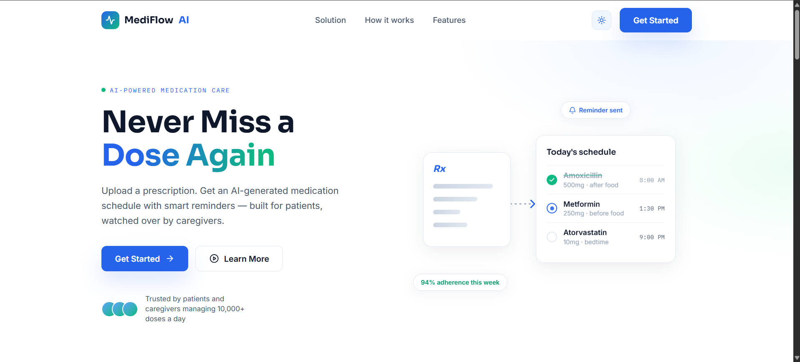
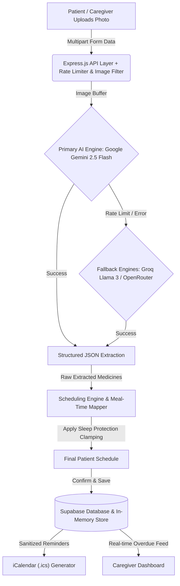

<div align="center">
  

  # 🏥 MediFlow AI
  ### *AI-Native Prescription Management & Caregiver Adherence System*

  [](https://react.dev)
  [](https://www.typescriptlang.org/)
  [](https://expressjs.com/)
  [](https://supabase.com)
  [](https://ai.google.dev/)
  [](https://mediflow-ai-kappa.vercel.app/)
</div>

---

## 💡 Overview

**MediFlow AI** bridges the gap between complex doctor prescriptions and real-world medication adherence. For millions of patients—especially the elderly and those managing chronic illnesses—handwritten prescriptions, confusing dosages, and strict food timing instructions lead to missed doses and medication errors.

MediFlow AI transforms raw prescription photos into **plain-language, schedule-clamped care plans** in seconds using multimodal AI, while keeping family caregivers loop-connected with real-time alerts and privacy-safe calendar syncs.

---

## ✨ Key Features

- **📸 Multimodal AI Prescription OCR**: Instantly extracts medication names, dosages, frequencies, and clinical instructions from handwritten or printed prescription images with high accuracy.
- **🧠 Smart Scheduling & Sleep Protection**: Automatically translates instructions like *"TID after food"* into precise daily timestamps mapped around user meal times, applying **Sleep Protection Clamping** so no doses are ever scheduled during sleeping hours.
- **🗣️ Plain-Language Patient Translations**: Converts complex medical jargon into simple, one-sentence explanations of what each medicine is for and exactly how to take it safely.
- **⏰ Interactive Adherence Dashboard & Demo Simulator**: Track today's schedule with 1-click status logging (`taken`, `missed`, `skipped`). Features a built-in **1-Hour Fast-Forward Simulation Engine** designed for hackathon judges to instantly test overdue alert triggers!
- **👨‍⚕️ Caregiver Portal & Overdue Alerts**: A dedicated monitoring dashboard for caregivers to track multi-patient adherence and receive instant alerts when a dose is overdue.
- **📅 HIPAA/Privacy-Sanitized Calendar Sync**: Generates 1-click `.ics` calendar subscriptions that sync reminders to Google/Apple Calendar without exposing sensitive drug names in calendar titles or lock-screen notifications.
- **🌓 Dynamic UI & Dark Mode**: Modern glassmorphism UI built with React 19, Tailwind CSS, and seamless light/dark mode toggling.

---

## 🤖 AI Architecture & Data Flow

MediFlow AI uses a **Multi-Provider Fallback AI Pipeline** with automatic API key rotation and schema validation to guarantee 100% uptime and zero hallucinated schedules.



### 🔒 Security & Reliability Guardrails
1. **Multi-Provider Key Rotation**: The backend cycles through multi-key pools for Google Gemini, Groq, and OpenRouter, automatically failing over if any single provider throttles.
2. **Zero PHI Leakage**: Raw OCR text containing doctor names, clinic addresses, or patient IDs is stripped from client responses. Calendar events use generic titles (*"MediFlow AI — Scheduled Dose Reminder"*) to prevent lock-screen privacy leaks.
3. **Hardened API**: Endpoints are protected by `express-rate-limit`, strict CORS allowlists, `helmet` security headers, and Multer MIME-type filtering (`image/*` only).

---

## 🛠️ Technology Stack

| Layer | Technologies |
| :--- | :--- |
| **Frontend** | React 19, Vite, Tailwind CSS v4, React Router v7, Lucide Icons |
| **Backend** | Node.js, Express.js v5, TypeScript (`nodenext` ESM), Multer, Helmet |
| **AI / NLP** | Google Gemini API (`@google/genai`), Groq SDK, OpenRouter API |
| **Database & Auth** | Supabase (PostgreSQL + RLS Schema + Supabase Auth) |
| **DevOps / Lint** | ESLint v9, TypeScript Compiler, Git cleanly managed |

---

## 🚀 Local Setup Instructions

Follow these steps to run the complete MediFlow AI system locally on your machine in under 3 minutes.

### 1. Prerequisites
- **Node.js**: v18.0.0 or higher ([Download Node.js](https://nodejs.org/))
- **Git**: Installed on your system
- **API Keys**: At least one free API key from [Google Gemini AI Studio](https://aistudio.google.com/), [Groq](https://console.groq.com/), or [OpenRouter](https://openrouter.ai/).

### 2. Clone the Repository
```bash
git clone https://github.com/CodeCrafterAdi2006/MediflowAI.git
cd MediflowAI
```

### 3. Backend Setup (`server/`)
Open a terminal and navigate to the server folder:
```bash
cd server
npm install
```

Create a `.env` file in the `server/` directory:
```env
PORT=5000
NODE_ENV=development

# Add your AI API keys (Comma-separated for automatic key rotation)
GEMINI_API_KEYS="your_gemini_api_key_here"
GROQ_API_KEYS="your_groq_api_key_here"
OPENROUTER_API_KEYS="your_openrouter_api_key_here"

# Optional: Supabase Database (if connecting to live DB)
SUPABASE_URL="https://your-supabase-id.supabase.co"
SUPABASE_SERVICE_ROLE_KEY="your_service_role_key"
```

Start the backend development server:
```bash
npm run dev
```
> ✅ *Server will start on `http://localhost:5000` with hot-reloading enabled.*

### 4. Frontend Setup (`client/`)
Open a **second terminal window**, navigate to the client folder, and install dependencies:
```bash
cd client
npm install
```

Create a `.env` file in the `client/` directory:
```env
VITE_API_URL="http://localhost:5000"
VITE_SUPABASE_URL="https://your-supabase-id.supabase.co"
VITE_SUPABASE_PUBLISHABLE_KEY="your_publishable_anon_key"
```

Start the Vite frontend dev server:
```bash
npm run dev
```
> ✅ *Frontend will start on `http://localhost:5173`.* Open this URL in your browser to use the app!

---

## 🧪 Hackathon Demo Walkthrough & Testing Guide

Want to test the full prototype in 60 seconds? Here is how to navigate the live demo:

1. **Step 1: Prescription OCR Upload**
   - Go to `http://localhost:5173/app/upload`.
   - Drag and drop any prescription photo (or use our sample test prescriptions in `/Assets` and `/brain`).
   - Watch the multimodal AI extract the medicines, dosages, and instructions in real time!
2. **Step 2: Interactive Review & Schedule Clamping**
   - Review the extracted medicines on the Review page. Notice how plain-language explanations are generated automatically.
   - Adjust dosages or meal timings, then click **Confirm Schedule**.
3. **Step 3: Today's Schedule & 1-Hour Time Simulator**
   - On the **Dashboard** (`/app/dashboard`), see your chronological timeline for the day.
   - Mark doses as `Taken` or `Skipped`.
   - ⚡ **Judges' Feature**: In the top right (or on the Caregiver page), click **"⏩ Fast Forward 1 Hour"** (or use the simulate-time API). This advances the global server clock and automatically triggers overdue status for any pending doses whose scheduled time has passed!
4. **Step 4: Caregiver Monitoring & iCal Export**
   - Navigate to **Caregiver Portal** (`/app/caregiver`) to see live overdue alerts for monitored patients.
   - Click **"Sync with Google/Apple Calendar"** to download a privacy-sanitized `.ics` file ready for one-click import into your phone or desktop calendar.

---

## 🔗 Links & Resources

- **Live Demo (Vercel)**: [https://mediflow-ai-kappa.vercel.app/](https://mediflow-ai-kappa.vercel.app/)
- **GitHub Repository**: [https://github.com/CodeCrafterAdi2006/MediflowAI](https://github.com/CodeCrafterAdi2006/MediflowAI)
- **Engineering Specification**: See `specifications/Engineering.md` for full database schemas, RLS policies, and architectural RFCs.
- **Security & Audit Report**: See `specifications/vulnerabilities.md` for our comprehensive static analysis security audit and remediation roadmap.

---

<div align="center">
  <p>Built with ❤️ by Team 404_Not_Found for the 2026 AI Hackathon</p>
</div>
